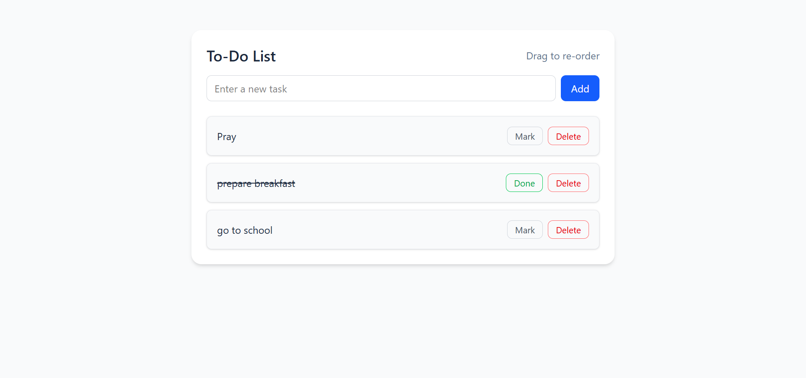

# To-Do List (React + TypeScript + Tailwind)
A simple, elegant To-Do List built with React, TypeScript, Tailwind CSS, and drag & drop functionality using @hello-pangea/dnd.


## Features:

Add new tasks (Enter key or Add button)

Drag & drop tasks to reorder (order is saved in state)

Mark tasks as completed

Delete tasks

## Technologies Used

React 19

TypeScript

Tailwind CSS

@hello-pangea/dnd (for drag & drop functionality)


# Project Structure

```
src/
│  App.tsx        # Main app container & state
│
├─ components/
│   │  TodoForm.tsx   # Input + Add button
│   │  TodoList.tsx   # Drag & drop wrapper for tasks
│   │  TodoItem.tsx   # Individual task item with delete & complete
│
│  index.tsx      # React entry point
│  index.css      # Tailwind base styles
```
# Installation
 ## 1. clone repository
```
   git clone https://github.com/Isingizwe12/todolist-typescript
   cd todolist-typescript
   ```
## 2.Install dependencies:

npm install

## 3.Start the development server:

npm start

Open http://localhost:3000
to view the app in the browser

## How to Use

1. Type a task in the input field and press Enter or click Add

2. Drag tasks to reorder them

3. Click Mark to complete a task (line-through effect)

4. Click Delete to remove a task

## Preview

